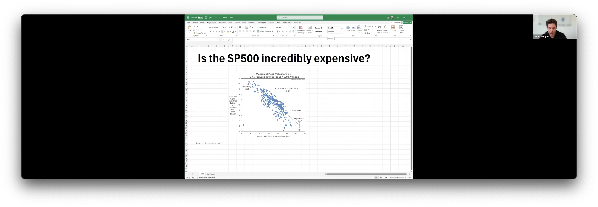
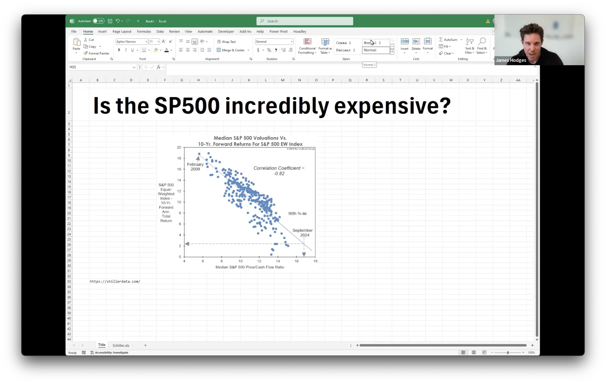
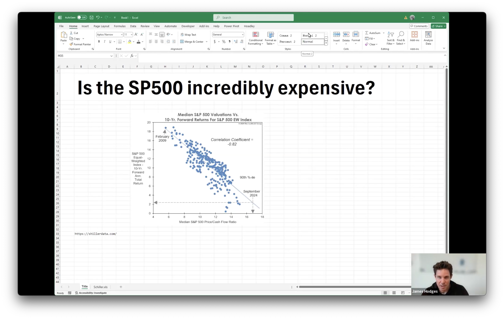

# Video Cropping

When screen recording, sometimes your video output has a resolution that's too wide. This can be caused by many things, such as using a ultra wide setup, or multiscreen, mismatches in screen scaling or DPI settings, or just plain bugs.

The notebook is a quick way to:

Go from this:

To this:

Or this:

Or other variations of the sort.

The notebook makes it easy to crop an area of your screen capture, and your camera feed, and overlay them to recreate the correct video output. It uses `ffmpeg`.

## Prerequisites

- **Python 3.6+**
- **FFmpeg** installed on your system:
  - macOS: `brew install ffmpeg`
  - Ubuntu: `sudo apt update && sudo apt install ffmpeg`
  - Windows: [Download FFmpeg](https://ffmpeg.org/download.html) and add it to your system path.

## Instructions

1. **Install `ffmpeg` using the above instructions, if not already installed.**
2. **Clone the Repository**:
   ```bash
   git clone https://github.com/mirceagrelus/video-cropper.git
3. Open the Notebook `cropping.ipynb` in your editor of choice (Jupyter, Visual Studio Code, etc). Visual Studio Code will prompt you to install the required plugins.

4. Specify the the input video path, and where to store the final output.
    ```python
    input_video = "./data/RWPro_input.mp4"
    ouptut_video = "./data/RWPro_final.mp4"
    ```
5. And specify the crop dimensions. This will show an interactive video player, and you can adjust dimensions for fit
    ```python
    # specify the dimensions to crop to. WIDTH:HEIGHT
    crop_dimension = "2000:1212"
    ```
    ```python
    # specify dimensions for speaker's head. Format: WIDTH:HEIGHT:X:Y
    # X, Y in graphics coordinates: 0.0 point is top, left.
    speaker_head_dimensions = "320:180:3776:0"
    ```
6. Generate the final video. Default speaker head position is top right corner, but that can be configured using the `overlay` element:
    
    Overlay formats:
    - `overlay=W-w:0`: top right corner.
    - `overlay=W-w-10:H-h-10`: bototm right corner with 10px spacing.

    `W`, `H` - represents width / height of first caption (`cropped`)

    `w`, `h`- represents width / height of second caption (`face`)
